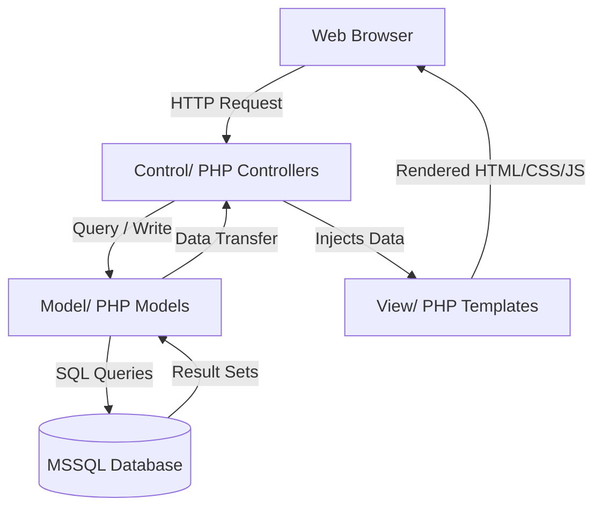

# Healthioneers — Vaccination Reservation & Management System

[](https://www.php.net/)
[](https://www.microsoft.com/en-us/sql-server/)
[](#architecture-overview)
[](LICENSE)

Healthioneers is a complete, feature-rich **Vaccination Reservation & Management System** built with native **PHP** using a custom **Model-View-Controller (MVC)** architecture and **Microsoft SQL Server**. It was developed as a Software Engineering project to streamline the booking, administration, and certification of vaccinations.

The application incorporates multi-role dashboards, automated **Two-Factor Authentication (2FA) via OTP email**, real-time vaccination tracking, and secure **PDF Vaccination Certificate** generation.

---

## 📖 Table of Contents

- [Key Features](#-key-features)
- [Architecture Overview](#-architecture-overview)
- [Tech Stack](#%EF%B8%8F-tech-stack)
- [Database Schema](#%EF%B8%8F-database-schema)
- [Folder Structure](#-folder-structure)
- [Getting Started](#-getting-started)
  - [Prerequisites](#prerequisites)
  - [Database Setup](#1-database-setup)
  - [Configuration](#2-configuration)
  - [Running the Application](#3-running-the-application)
- [Screenshots & User Roles](#-screenshots--user-roles)
- [License](#-license)

---

## ✨ Key Features

### 👤 Patient Portal
* **Secure Registration & Verification:** Real-time validations (14-digit National ID, 11-digit phone number) and OTP-based email verification during sign-up.
* **Two-Factor Authentication (2FA):** 2FA OTP sent to email on every login for enhanced security.
* **Interactive Vaccine Search:** Browse available vaccines, doses details, gap days, and health precautions.
* **Appointment Booking:** Select vaccines and local vaccination centers to schedule first/second doses.
* **Digital Certificates:** Download formal, tamper-evident PDF vaccination certificates upon completion of both doses.

### 🏥 Vaccination Center Portal
* **Daily Reservation List:** View and search reservations scheduled for the current day.
* **Dose Confirmations:** Log and confirm the administration of the 1st and 2nd doses for patients.
* **Center Profile Management:** Manage contact details, addresses, and account credentials.

### 🔑 Admin Portal
* **Dashboard Analytics:** Comprehensive control panels to monitor registration statistics and system health.
* **Vaccine & Center Management:** Add new vaccine types, register vaccination centers, update center details, and modify/deactivate credentials.
* **City Management:** Expand operational cities across Egypt.
* **Patient Management:** Lookup, search, and suspend/activate patient accounts.

---

## 🏛️ Architecture Overview

The project uses a clean **MVC (Model-View-Controller)** pattern separating business logic, data presentation, and data management:



* **Models (`/Model`):** Handle direct database interactions using Microsoft's `sqlsrv` PHP driver.
* **Views (`/View`):** Handle layout, visual representation, and client forms using Vanilla CSS & JS.
* **Controllers (`/Control`):** Coordinate workflows, validate forms, manage sessions, handle role permissions, and control application state.

---

## 🛠️ Tech Stack

* **Backend Language:** PHP (v8.x recommended)
* **Design Pattern:** Model-View-Controller (MVC)
* **Database:** Microsoft SQL Server (MSSQL)
* **Styling & UI:** Vanilla CSS (Glassmorphism, flexbox/grid layouts, micro-animations)
* **Libraries (included in `/libs`):**
  * **PHPMailer:** For sending SMTP verification emails and OTPs.
  * **TCPDF:** For generating downloadable PDF vaccination certificates.

---

## 🗄️ Database Schema

The system uses a relational schema stored in the `Vaccination` database. The schema diagram and tables consist of:

* `Patients`: Stores demographic data, credentials, and account statuses.
* `Vaccines`: Defines vaccine types, dosage gaps, and precautions.
* `Vaccination_Centers`: Lists operational centers, cities, addresses, and credentials.
* `Cities`: Lookup table for Egyptian cities.
* `Reservations`: Tracks bookings, dose statuses (1st & 2nd confirmation dates), and assigned centers.
* `Admin`: Access credentials for system administrators.

Refer to [SQL Queries/Vaccines.sql](file:///d:/University/Level%202%20First%20Semester/Software%20Engineering%20-%201/PHP%20Projects/Overflow%20MVC/SQL%20Queries/Vaccines.sql) for the complete DDL schema definition and sample seeding scripts.

---

## 📂 Folder Structure

```text
Overflow MVC/
│
├── Control/                  # Application Controllers
│   ├── Admin/                # Admin business logic
│   ├── Center/               # Vaccination Center business logic
│   ├── Patient/              # Patient business logic
│   ├── LoginController.php   # Login and 2FA controller
│   ├── RegisterController.php# Patient registration logic
│   ├── VerifyController.php  # OTP Email verification logic
│   └── logout.php            # Session termination
│
├── Model/                    # Database Intermediaries (Models)
│   ├── Admin/                # Admin DB operations
│   ├── Center/               # Center DB operations
│   ├── Patient/              # Patient DB operations
│   ├── DatabaseConnection.php# Singleton Database Connection
│   └── LoginModel.php        # Authentications & Mailer operations
│
├── View/                     # Visual presentation templates (Views)
│   ├── Admin/                # Admin dashboards
│   ├── Center/               # Center dashboards & list search views
│   └── Patient/              # Patient home/reservation/vaccine views
│
├── Public/                   # Public assets & entry point
│   ├── css/                  # Custom CSS sheets
│   ├── js/                   # Javascript visual behaviors
│   ├── Imgs/                 # Graphics & static team photos
│   └── HomePage.php          # Main public marketing page
│
├── SQL Queries/              # DB setup scripts
│   └── Vaccines.sql          # SQL Server schema & seed data
│
└── libs/                     # Third party libraries (PHPMailer, TCPDF, etc.)
```

---

## 🚀 Getting Started

To run this application locally on your machine, follow these steps:

### Prerequisites
* **Web Server:** Apache (via XAMPP, WampServer) or IIS.
* **PHP:** v8.0 or higher.
* **Database:** Microsoft SQL Server.
* **Drivers:** Microsoft Drivers for PHP for SQL Server (`php_sqlsrv.dll` and `php_pdo_sqlsrv.dll` extensions enabled in your `php.ini`).

### 1. Database Setup
1. Open SQL Server Management Studio (SSMS) or your preferred SQL tool.
2. Open and run the SQL script located in the project at [SQL Queries/Vaccines.sql](file:///d:/University/Level%202%20First%20Semester/Software%20Engineering%20-%201/PHP%20Projects/Overflow%20MVC/SQL%20Queries/Vaccines.sql).
3. This will create the database `Vaccination`, set up tables, and seed initial cities, an admin, and a test vaccination center.

### 2. Configuration
Configure database connection settings and mail SMTP keys before starting:

* **Database Connection:** Open [Model/DatabaseConnection.php](file:///d:/University/Level%202%20First%20Semester/Software%20Engineering%20-%201/PHP%20Projects/Overflow%20MVC/Model/DatabaseConnection.php) and adjust `$serverName` and `$connectionOptions` if your SQL Server instance uses a custom hostname or authentication credentials:
  ```php
  $serverName = "YOUR_SQL_SERVER_NAME"; // e.g. DESKTOP-XXXXXX
  $connectionOptions = [
      "Database" => "Vaccination",
      "Uid" => "your_username", // Leave blank for Windows Authentication
      "PWD" => "your_password"
  ];
  ```
* **SMTP (PHPMailer) Setup:** Open [Model/LoginModel.php](file:///d:/University/Level%202%20First%20Semester/Software%20Engineering%20-%201/PHP%20Projects/Overflow%20MVC/Model/LoginModel.php), [Control/RegisterController.php](file:///d:/University/Level%202%20First%20Semester/Software%20Engineering%20-%201/PHP%20Projects/Overflow%20MVC/Control/RegisterController.php), and [Control/VerifyController.php](file:///d:/University/Level%202%20First%20Semester/Software%20Engineering%20-%201/PHP%20Projects/Overflow%20MVC/Control/VerifyController.php) to configure Gmail SMTP details:
  ```php
  private $senderEmail = 'your-email@gmail.com';
  private $senderPassword = 'your-gmail-app-password';
  ```
  *(Note: For security reasons, configure App Passwords instead of your primary Gmail password.)*

### 3. Running the Application
1. Place the project directory under your web server directory (e.g., `htdocs` for XAMPP).
2. Start the Apache/IIS web server.
3. Access the website via your browser:
   ```url
   http://localhost/Overflow%20MVC/Public/HomePage.php
   ```

---

## 👥 Seed Credentials (Default)

Use these seeded details (created from the SQL file) to log into the application dashboards:

* **Administrator:**
  * **Email/Username:** `...@gmail.com` *(Check schema setup for the exact username or modify/seed your own)*
  * **Password:** `123456789`
* **Vaccination Center:**
  * **Email/Username:** `...@gmail.com` *(Check schema setup for details)*
  * **Password:** `123456789`

*(Remember to change default credentials in production!)*

---

## 📄 License

This project is licensed under the MIT License - see the [LICENSE](LICENSE) file for details.
